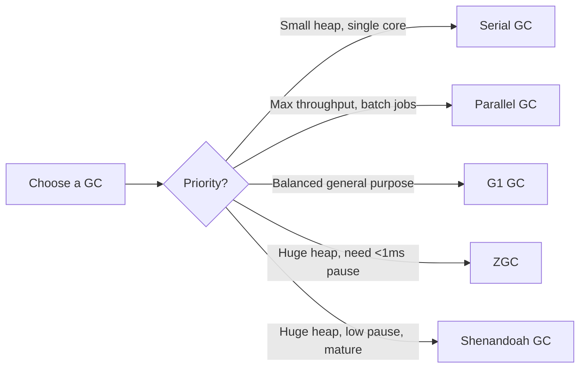
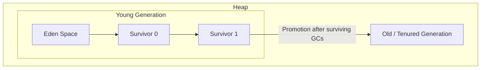
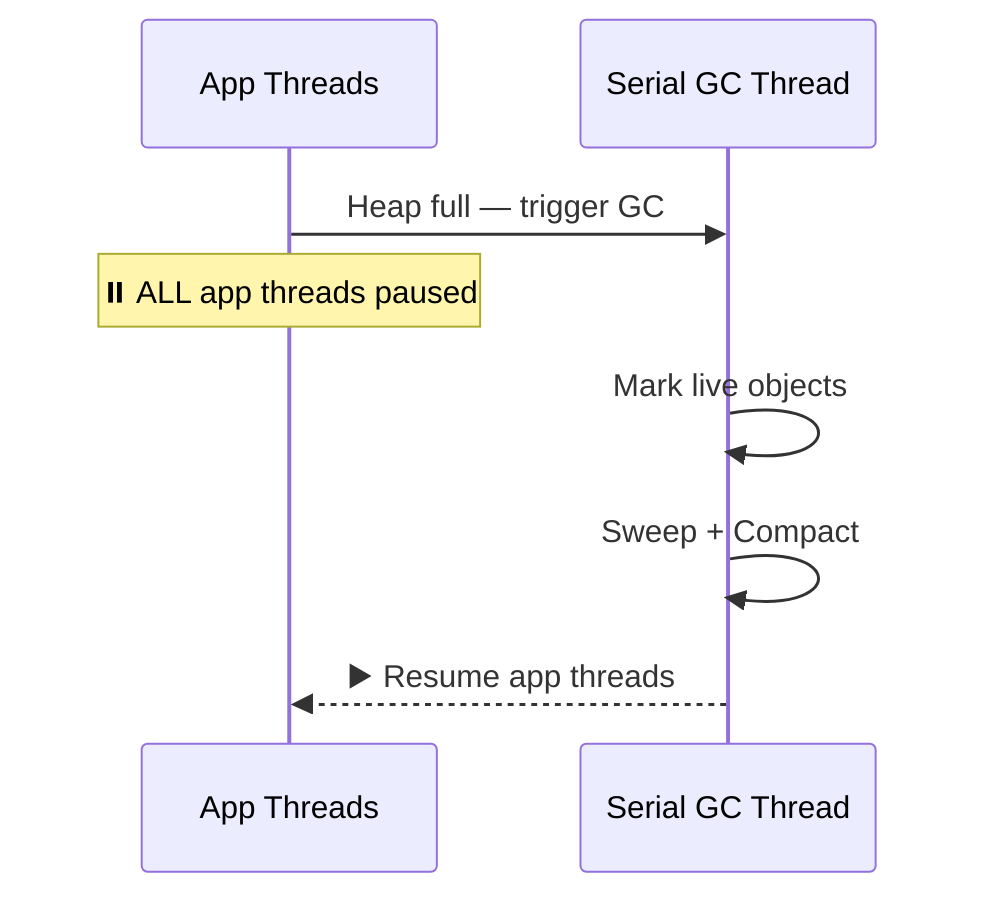
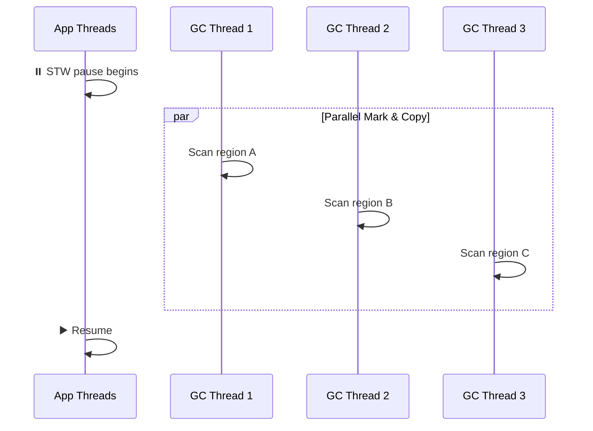
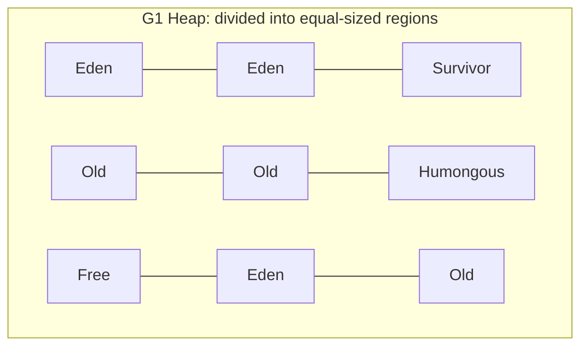
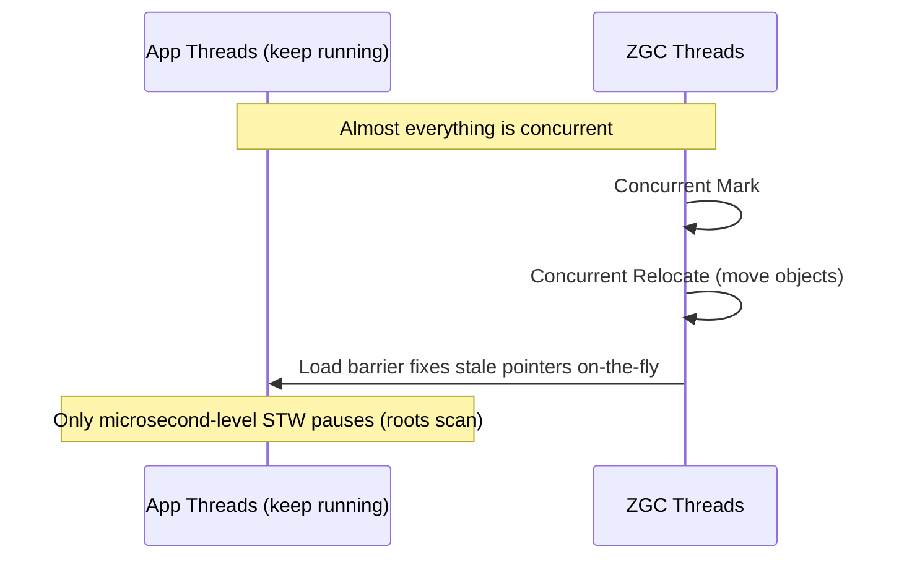
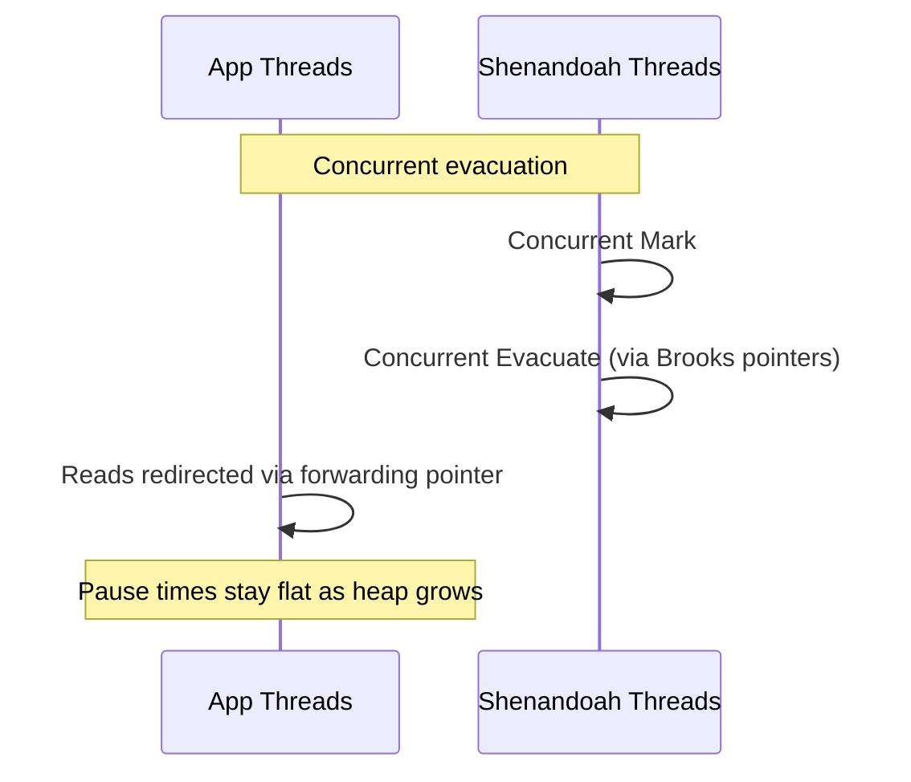

## 📑 Table of Contents

- [[#Why Multiple GC Algorithms Exist]]
- [[#Quick Comparison Table]]
- [[#Heap Structure Refresher]]
- [[#1. Serial GC]]
- [[#2. Parallel GC]]
- [[#3. G1 GC (Garbage First)]]
- [[#4. ZGC (Z Garbage Collector)]]
- [[#5. Shenandoah GC]]
- [[#Decision Guide — Which GC to Pick]]
- [[#Key Terms Glossary]]

---

## Why Multiple GC Algorithms Exist

Every GC algorithm makes a **trade-off** between three competing goals:

1. **Throughput** — % of total time spent doing actual application work (vs. GC work)
2. **Latency** — length of "stop-the-world" (STW) pauses where the app freezes
3. **Footprint** — memory/CPU overhead the collector itself consumes

> [!tip] Golden Rule No GC is universally "best." Choosing one means picking **which two of the three** (throughput, latency, footprint) matter most for your application.

---

## Quick Comparison Table

|Garbage Collector|Primary Goal|Multi-Threaded?|Default in JVM?|
|---|---|:-:|---|
|**Serial**|Lowest resource footprint|❌ No|❌ No|
|**Parallel**|High throughput|✅ Yes|Former default (Java 8)|
|**G1**|Balanced throughput & latency|✅ Yes|✅ Yes (Java 9+)|
|**ZGC**|Ultra-low latency (**< 1ms** pauses)|✅ Yes|❌ No|
|**Shenandoah**|Ultra-low latency|✅ Yes|❌ No|

---

## Heap Structure Refresher

Most collectors below operate on the **generational hypothesis**: _most objects die young_.

- **Young Gen** → new objects allocated here (Eden); minor GC is fast & frequent
- **Survivor spaces** → objects that survive a minor GC bounce between S0/S1
- **Old Gen** → long-lived objects promoted here; major/full GC is slower & rarer

> [!note] G1, ZGC, and Shenandoah don't use a strict contiguous young/old layout — they divide the heap into **regions** instead (explained per-collector below).

---

## 1. Serial GC

> [!abstract] Summary The simplest collector — a **single thread** does all GC work while **all application threads are frozen** (stop-the-world).

- **Flag to enable**: `-XX:+UseSerialGC`
- **Threading**: Single-threaded (both young & old gen collection)
- **Algorithm**: Mark-Copy (young gen) + Mark-Sweep-Compact (old gen)

**How it works:**

**Best for:**

- Small heaps (client apps, embedded devices)
- Single-CPU / single-core environments
- Short-lived scripts/CLI tools where footprint > pause time

**Trade-off:** Pauses scale with heap size — unacceptable for large heaps or server apps.

---

## 2. Parallel GC

> [!abstract] Summary The "throughput collector." Uses **multiple threads** for GC work, but still **stops the world** — it just does the stopped work faster.

- **Flag to enable**: `-XX:+UseParallelGC`
- **Threading**: Multi-threaded (parallel mark & copy/compact)
- **Was the default in**: Java 8 and earlier

**How it works:**

**Best for:**

- Batch processing, data pipelines, scientific computing
- Workloads where **total throughput** matters more than individual pause length
- Apps that can tolerate occasional longer pauses (seconds) in exchange for maximum CPU efficiency between pauses

**Trade-off:** Pause times grow with heap size — not suitable for latency-sensitive services (e.g., trading systems, live APIs).

---

## 3. G1 GC (Garbage First)

> [!abstract] Summary The **default GC since Java 9**. Balances throughput and latency by dividing the heap into many small **regions** and collecting the regions with the _most garbage first_.

- **Flag to enable**: `-XX:+UseG1GC`
- **Threading**: Multi-threaded, mostly concurrent with some STW phases
- **Target**: Configurable pause-time goal via `-XX:MaxGCPauseMillis=200`

**Heap layout — region-based, not fixed young/old blocks:**

_Each region can dynamically become Eden, Survivor, Old, or Humongous (for very large objects)._

**How it works:**

1. Concurrently marks which regions have the most garbage
2. During a pause, collects **only those regions** first ("Garbage First") — hence the name
3. Copies live objects out, freeing entire regions at once

**Best for:**

- General-purpose server applications (most modern web services default to this)
- Medium-to-large heaps (multiple GB) needing predictable, bounded pauses
- Teams that want good performance **without heavy tuning**

**Trade-off:** More CPU/memory overhead than Serial/Parallel; not as low-latency as ZGC/Shenandoah for very large heaps (100GB+).

---

## 4. ZGC (Z Garbage Collector)

> [!abstract] Summary A **scalable, low-latency** collector designed to keep pause times **under 1 millisecond**, regardless of heap size (tested up to multi-terabyte heaps).

- **Flag to enable**: `-XX:+UseZGC`
- **Threading**: Fully concurrent — marking, relocation, and reference updating all happen **while the app keeps running**
- **Key technique**: **Colored pointers** + **load barriers** to track object state without stopping threads

**How it works:**

**Best for:**

- Applications needing **sub-millisecond pause guarantees** (real-time trading, gaming servers, large in-memory caches)
- **Very large heaps** (tens of GB to TB range) where G1 pause times become unacceptable

**Trade-off:** Slightly lower raw throughput than Parallel GC; higher memory overhead due to colored pointers; relatively newer (production-ready from JDK 15+).

---

## 5. Shenandoah GC

> [!abstract] Summary Developed by Red Hat, similar goal to ZGC — **ultra-low pause times independent of heap size** — but uses a different technique: **Brooks pointers** (forwarding pointers) for concurrent compaction.

- **Flag to enable**: `-XX:+UseShenandoahGC`
- **Threading**: Fully concurrent marking, evacuation, and compaction
- **Key technique**: Each object has a forwarding pointer letting the GC move it while the app still accesses it correctly

**How it works:**

**Best for:**

- Same use cases as ZGC — low-latency services with large heaps
- Environments already standardized on OpenJDK/Red Hat builds

**Trade-off:** Similar overhead profile to ZGC (extra memory word per object for the forwarding pointer); slightly more mature than ZGC in some early JDK versions but converging in capability over time.

---

## Decision Guide — Which GC to Pick

|Scenario|Recommended GC|
|---|---|
|Small app, 1 CPU, embedded/CLI tool|**Serial**|
|Batch job, offline data processing, throughput is king|**Parallel**|
|Typical web service / microservice, no special tuning|**G1** (default anyway)|
|Large heap (10s–100s of GB), need pause < 1ms|**ZGC** or **Shenandoah**|
|Real-time systems (trading, gaming)|**ZGC** or **Shenandoah**|

---

## Key Terms Glossary

|Term|Meaning|
|---|---|
|**STW (Stop-The-World)**|A pause where all application threads are frozen so the GC can safely work|
|**Concurrent GC**|GC work done _alongside_ running application threads (minimal/no STW)|
|**Mark-Sweep-Compact**|Mark live objects → sweep (remove) dead ones → compact (defragment) memory|
|**Region-based heap**|Heap divided into many equal-sized chunks (used by G1, ZGC, Shenandoah) instead of fixed young/old blocks|
|**Colored Pointers**|ZGC technique: metadata bits embedded in the pointer itself to track object state concurrently|
|**Brooks Pointers**|Shenandoah technique: forwarding pointer stored with each object to allow concurrent relocation|
|**Throughput**|% of time the JVM spends running your app vs. doing GC|
|**Latency**|Duration of individual GC pauses|
|**Footprint**|Memory/CPU overhead consumed by the GC mechanism itself|

---
