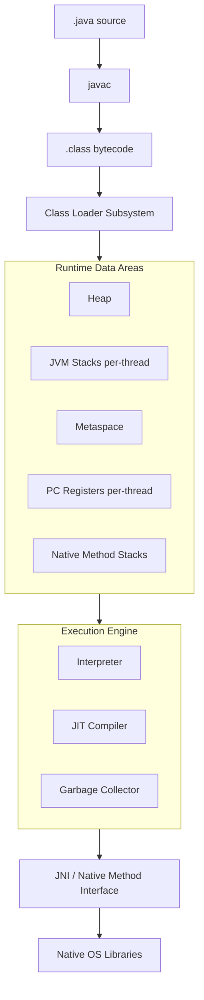
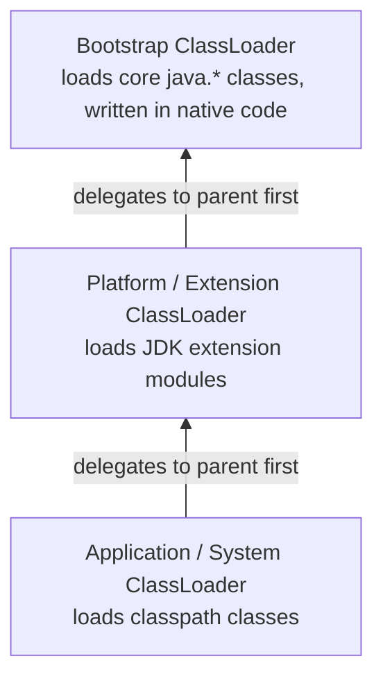
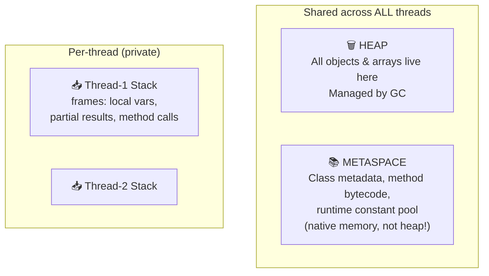
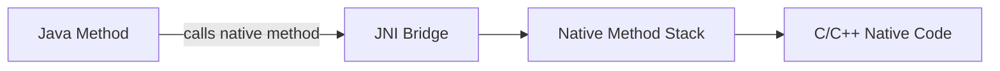
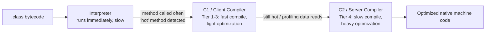
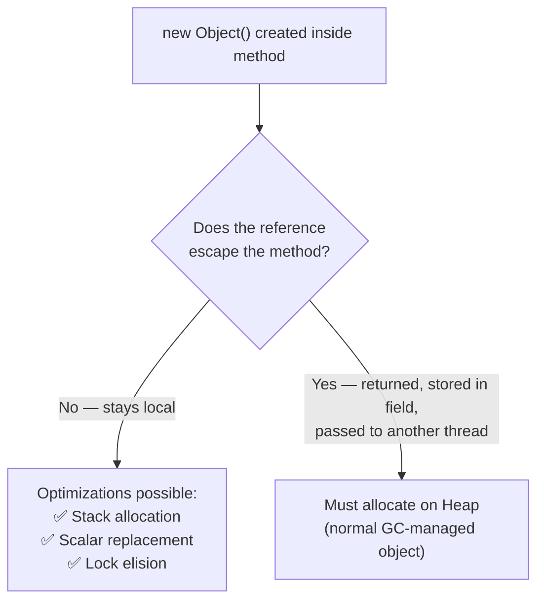
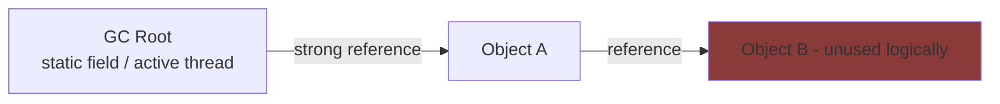
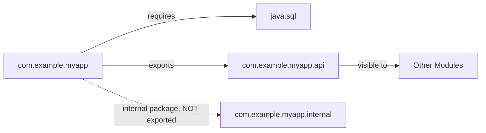

# ☕ JVM Internals — Complete Study Notes

> [!info] Scope Covers all 14 topics: **Architecture & Memory Areas**, **Compilation & Optimization**, and **Memory Issues & Modules**. Garbage Collection topics (Generational GC, G1, ZGC, Shenandoah) live in a separate note → [[JVM_Garbage_Collectors]]

## 📑 Table of Contents

- [[#🏗️ Architecture & Memory Areas]]
    - [[#1. JVM Architecture Overview]]
    - [[#2. Class Loading & Class Loader Hierarchy]]
    - [[#3. Heap, Stack, Metaspace]]
    - [[#4. Program Counter (PC) Register]]
    - [[#5. Native Method Stack]]
- [[#⚙️ Compilation & Optimization]]
    - [[#6. JIT Compiler (Tiered Compilation)]]
    - [[#7. AOT Compiler (vs JIT)]]
    - [[#8. Escape Analysis]]
- [[#🧩 Memory Issues & Modules]]
    - [[#9. Memory Leaks (Refs & Cycles)]]
    - [[#10. OutOfMemoryError Types]]
    - [[#11. Java Modules (JPMS, module-info.java)]]

---

# 🏗️ Architecture & Memory Areas

## 1. JVM Architecture Overview

> [!abstract] Summary The JVM has three major subsystems: **Class Loader Subsystem** (loads `.class` files), **Runtime Data Areas** (memory), and the **Execution Engine** (runs bytecode).



**The three pillars:**

1. **Class Loader Subsystem** — locates, reads, and loads `.class` files into memory (Loading → Linking → Initialization)
2. **Runtime Data Areas** — the memory regions the JVM manages (heap, stacks, metaspace, PC register)
3. **Execution Engine** — actually runs the bytecode via the **Interpreter**, **JIT Compiler**, and works with the **Garbage Collector**

> [!tip] Think of the JVM as: _"read the class file → put it in memory in the right area → execute it, optimizing hot code as it runs."_

---

## 2. Class Loading & Class Loader Hierarchy

> [!abstract] Summary Classes are loaded lazily (on first use) by a **hierarchy of class loaders** following the **delegation model** — a child loader always asks its parent first before loading a class itself.



**The 3 phases of class loading:**

|Phase|Sub-step|What happens|
|---|---|---|
|**Loading**|—|Reads `.class` bytes, creates a `Class` object in Metaspace|
|**Linking**|Verify|Checks bytecode is structurally valid and safe|
||Prepare|Allocates memory for static fields, sets default values|
||Resolve|Converts symbolic references (names) into direct references|
|**Initialization**|—|Runs static initializers and static blocks (`static { }`) top to bottom|

**Delegation Model (parent-first):**

- A request to load a class always goes **up to the Bootstrap loader first**
- Only if the parent _can't_ find the class does the child try to load it itself
- **Why?** Prevents core classes like `java.lang.String` from being overridden/spoofed by user code (security)

> [!note] Custom Class Loaders You can write your own `ClassLoader` subclass (e.g., for plugin systems, hot-reloading) by overriding `findClass()` — commonly seen in app servers and frameworks like OSGi.

---

## 3. Heap, Stack, Metaspace

> [!abstract] Summary The three core memory regions — each with a different lifetime, sharing model, and purpose.



|Area|Stores|Shared?|Lifetime|Error if exhausted|
|---|---|---|---|---|
|**Heap**|Objects, arrays, instance fields|✅ All threads|Until GC'd|`OutOfMemoryError: Java heap space`|
|**Stack**|Method frames, local variables, partial results, return addresses|❌ Per-thread|Per method call (LIFO)|`StackOverflowError`|
|**Metaspace**|Class definitions, method bytecode, constant pool (replaced PermGen in Java 8+)|✅ All threads|Until classloader is GC'd|`OutOfMemoryError: Metaspace`|

> [!note] Heap vs. PermGen vs. Metaspace Before Java 8, class metadata lived in **PermGen** (fixed-size, part of heap-adjacent space, prone to `OOM: PermGen space`). Java 8+ replaced it with **Metaspace**, which lives in **native (off-heap) memory** and grows dynamically by default.

---

## 4. Program Counter (PC) Register

> [!abstract] Summary A small, **per-thread** register that holds the address of the **JVM instruction currently being executed** by that thread.

- Every thread gets its **own PC register** — this is what makes context-switching between threads possible
- If the current method is **native**, the PC register value is **undefined**
- If executing **JVM bytecode**, it holds the address/offset of the current instruction

**Why it matters:** When the OS/JVM pauses a thread and resumes it later, the PC register tells the thread _exactly where to resume execution_.

---

## 5. Native Method Stack

> [!abstract] Summary A separate per-thread stack used specifically when a thread executes **native (non-Java) code** — typically C/C++ via **JNI (Java Native Interface)**.



- Used when Java code calls into native libraries (e.g., OS-level APIs, performance-critical native libs)
- Separate from the regular JVM stack because native code has different calling conventions and frame structures
- Some JVMs (like HotSpot) **combine** the native method stack with the regular thread stack — implementation-dependent per the JVM spec

---

# ⚙️ Compilation & Optimization

## 6. JIT Compiler (Tiered Compilation)

> [!abstract] Summary The **Just-In-Time compiler** converts frequently executed ("hot") bytecode into optimized native machine code at runtime, instead of interpreting it every time.



**Tiered Compilation levels (HotSpot JVM):**

|Tier|Compiler|Description|
|---|---|---|
|0|Interpreter|Pure bytecode interpretation, collects profiling data|
|1|C1 (no profiling)|Simple methods compiled quickly, no instrumentation|
|2–3|C1 (with profiling)|Compiled with increasing levels of instrumentation|
|4|C2|Fully optimized compilation using collected profile data (inlining, loop unrolling, etc.)|

**Why "tiered"?** Balances **startup speed** (C1 compiles fast) with **peak performance** (C2 produces highly optimized code) — the JVM promotes a method through tiers as it gets hotter.

> [!tip] Key flags `-XX:+TieredCompilation` (on by default) · `-XX:TieredStopAtLevel=1` (C1 only, faster startup, common for short-lived CLI apps)

---

## 7. AOT Compiler (vs JIT)

> [!abstract] Summary **Ahead-Of-Time compilation** compiles bytecode to native machine code **before** the program runs (at build time), rather than during execution.

||**JIT**|**AOT**|
|---|---|---|
|**When compiled**|At runtime, incrementally|At build time, once|
|**Startup time**|Slower (interpreter runs first)|⚡ Very fast (already native)|
|**Peak performance**|Higher — uses real runtime profiling data|Lower — no runtime profile info available|
|**Adaptability**|Can re-optimize based on actual usage patterns|Fixed — can't adapt after compilation|
|**Example tech**|HotSpot's C1/C2|GraalVM Native Image, jaotc (removed in JDK 17)|

**Best for AOT:** Serverless functions, CLI tools, containers — anywhere **fast startup** and **low memory footprint** matter more than peak throughput (e.g., GraalVM Native Image for microservices with sub-second cold starts).

**Best for JIT:** Long-running server applications where the JVM has time to "warm up" and reach peak optimized performance.

---

## 8. Escape Analysis

> [!abstract] Summary A JIT optimization technique that determines whether an object's **reference "escapes"** the method/thread it was created in. If it doesn't escape, the JVM can skip heap allocation entirely.



**Three optimizations enabled by escape analysis:**

1. **Stack allocation** — object allocated on the (fast, auto-cleaned) stack frame instead of the heap
2. **Scalar replacement** — object's fields are broken apart into individual local variables (no object at all!)
3. **Lock elision** — if a `synchronized` object is proven thread-local (never escapes), the JVM removes the locking overhead entirely

**Why it matters:** Reduces GC pressure — fewer heap allocations means fewer objects to trace/collect.

> [!note] Enabled by default in HotSpot: `-XX:+DoEscapeAnalysis`

---

# 🧩 Memory Issues & Modules

## 9. Memory Leaks (Refs & Cycles)

> [!abstract] Summary Unlike C/C++, the JVM uses a **tracing garbage collector** (not reference counting) — so **reference cycles are NOT a memory leak** in Java. A Java "memory leak" means an object is **still reachable from a GC root** even though the program logically no longer needs it.



_Object B is "leaked" — it's unreachable in terms of program logic, but still reachable from a GC Root, so the collector can never free it._

**Common causes of memory leaks in Java:**

|Cause|Explanation|
|---|---|
|**Static collections**|`static List/Map` that keeps growing and is never cleared|
|**Unregistered listeners/callbacks**|Listener added but never removed — keeps referencing the parent object|
|**Inner (non-static) classes**|Hold an implicit reference to their outer class instance|
|**ThreadLocal misuse**|Not calling `.remove()` — value stays alive as long as the thread does (dangerous in thread pools)|
|**Unclosed resources**|Streams, connections not closed, holding native/heap memory|
|**Caching without eviction**|Cache grows unbounded — use `WeakHashMap` / bounded caches (Caffeine, Guava) instead|

> [!tip] Cycles are fine `A → B → A` (a reference cycle) is automatically collected by JVM's tracing GC **as long as nothing outside the cycle references A or B**. This is a key difference from manual/ref-counted memory management.

---

## 10. OutOfMemoryError Types

> [!abstract] Summary `OutOfMemoryError` (OOM) isn't one error — the **message tells you exactly which memory area was exhausted**.

|OOM Message|Meaning|Common Fix|
|---|---|---|
|`Java heap space`|Heap is full, GC can't reclaim enough|Increase `-Xmx`, fix leaks, review object retention|
|`GC overhead limit exceeded`|JVM spends >98% of time in GC, reclaiming <2% of heap|Same as above — GC is "thrashing"|
|`Metaspace`|Class metadata space exhausted|Increase `-XX:MaxMetaspaceSize`, check for classloader leaks (e.g., repeated hot-reloads)|
|`Unable to create new native thread`|OS thread limit reached, or native memory exhausted|Reduce thread pool sizes, increase OS `ulimit`, check for thread leaks|
|`Direct buffer memory`|`ByteBuffer.allocateDirect()` off-heap memory exhausted|Increase `-XX:MaxDirectMemorySize`, ensure buffers are released|
|`Requested array size exceeds VM limit`|Trying to allocate an array larger than the JVM allows|Check array-size calculation logic — likely a bug|
|`StackOverflowError` _(not technically OOM)_|A single thread's stack exceeded its size limit|Usually infinite/too-deep recursion — fix logic or increase `-Xss`|

> [!tip] Debugging OOM Use `-XX:+HeapDumpOnOutOfMemoryError` to auto-generate a heap dump on crash, then analyze it with **Eclipse MAT** or **VisualVM** to find the retained object graph.

---

## 11. Java Modules (JPMS, module-info.java)

> [!abstract] Summary The **Java Platform Module System** (Project Jigsaw, introduced in **Java 9**) adds a layer above packages/JARs for **strong encapsulation** and explicit dependency declaration.

**Anatomy of `module-info.java`:**

```java
module com.example.myapp {
    requires java.sql;              // depends on the java.sql module
    requires transitive com.example.utils; // dependents also get this dependency

    exports com.example.myapp.api;  // public API, visible to other modules
    exports com.example.myapp.spi to com.example.plugin; // visible only to specific module

    uses com.example.myapp.spi.PluginService;      // service consumer
    provides com.example.myapp.spi.PluginService
        with com.example.myapp.impl.DefaultPlugin;  // service provider
}
```

**Key directives:**

|Directive|Purpose|
|---|---|
|`requires`|Declares a dependency on another module|
|`requires transitive`|Passes the dependency along to anyone who depends on _this_ module|
|`exports`|Makes a package's public types accessible to other modules|
|`exports ... to`|Restricts export to specific named modules (qualified export)|
|`opens`|Allows reflective access (e.g., for frameworks like Spring/Hibernate) without full export|
|`uses` / `provides ... with`|Service Provider Interface (SPI) — loose coupling via `ServiceLoader`|



**Why JPMS matters:**

- **Strong encapsulation** — internal packages are truly hidden (not just `public` by convention); reflection can't bypass it unless `opens` is used
- **Reliable configuration** — missing dependencies fail fast at **startup**, not at runtime with a `ClassNotFoundException`
- **Smaller runtime images** — `jlink` can build a custom minimal JRE containing only the modules your app needs

> [!note] Everything is a module now Even the JDK itself is modularized (`java.base`, `java.sql`, `java.desktop`, etc.). `java.base` is implicitly required by every module — no need to declare it.

---

